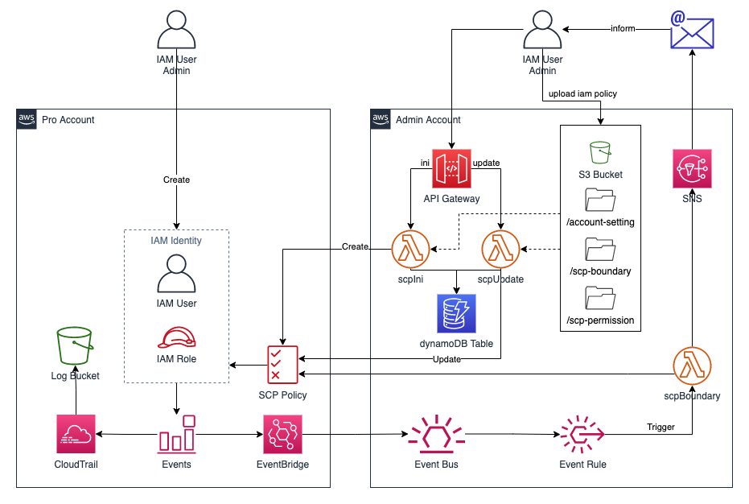

# SCP Workaround in AWS China Regions

[中文](README.md) ｜ English

[toc]

[Mar 25, 2019](https://aws.amazon.com/about-aws/whats-new/2019/03/service-control-policies-enable-fine-grained-permission-controls/?nc1=h_ls)，AWS released [Service Control Policie (SCP)](https://docs.aws.amazon.com/zh_cn/organizations/latest/userguide/orgs_manage_policies_scps.html) feature. This offers central control over the maximum available permissions for all accounts in your organization. 

Till April 2021, the two AWS regions in mainland China (BJS, ZHY) do not support SCP functionality. An workaround solution of SCP functionality in BJS and ZHY is discussed below. This solution has the following features:

1. Automation. Automatically attaching permission boundary to IAM entities created in the managed account. 
2. Serverless. This solution eliminates the need of EC2, and consequentlly eliminates the maintenance work from OS level.  
3. Low Cost. This solution only generates calls/costs when the user creates an IAM entity, the total cost is close to 0.

**NOTE**: This solution is not retroactive, that is, the permission boundaries of all IAM entities created prior to the deployment of this solution are not controlled by this solution.

# Architecture Design
## Architecture Briefing
When user creating an IAM entity (IAM User or IAM Role), a Lambda function is triggered by this event. The lambda function will associate a permission boundary (an IAM Policy) to the created IAM entity to control its maximum available permissions. The architecture draft is illustrated in the following diagram: 


However, we still need to pay attention to the following three key issues if we plan to deploy this solution in a production system:

1. When an IAM entity is created with AdminFullAccess, or IAMFullAccess, how to protect above solution from being deleted (e.g., users use their Admin permissions to delete lambda functions, or remove permission boundaries that are associated with them, etc.)
2. Enterprises that need SCP functions often have multiple accounts, how to achieve unified management of multiple accounts? And ensure that permission boundaries can be set for different accounts from the unified platform?
3. When more and more production accounts are managed by a central admin account, how to track which kind of permission policy are used by different accounts?

To solve the above three key points, some AWS services are adopted: 

- Amazon API Gateway
- Amazon S3 
- Amazon EventBridge
- Amazon DynamoDB 
- Amazon SNS
- Amazon DynamoDB  

The whole architecture is as follows:  


Admin Account is used to deploy and configure related administrative resources.  
Pro Account is a managed account that requires permission restrictions through SCP functionality.

## Admin Account 
The function of Admin Account: 

1. To initialize a Pro Account, need to create the following resources in **Pro Account**:
	- S3 Bucket: Prerequisite of creating Cloudtrail trail
	- Cloudtrail Trail: To capture IAM events when an IAM entity is created
	- EventBridge Rule: To pass filtered events to the Event Bus in Admin Account
	- IAM Policy: Policies that need to be attached to all newly created IAM entities

2. To manage the permission boundary policies used by Pro Account, you need to create the following resources in **Admin Account**:
	- S3 Bucket: To store all configuration files, and the policy files needed when creating an IAM Policy in Pro Account
	- DynamoDB Table: To record the attaching information between the Pro Account and the policy file
	
3. Receiving events from the Pro Account in order to trigger the Lambda function to automatically attach control policies, the following resources need to be created in the **Admin Account**:
	- EventBridge Bus: To allow receiving IAM events from Pro Account
	- EventBridge Rule: To filter events of IAM entities creation (CreateUser and CreateRole)

4. To achieve the automation of the above functionality, the following resources need to be created in **Admin Account**:
	- API Gateway:
		- ini: Environment initialization in Pro Account
		- update: Update permission boundary policy
	- Lambda:
		- scpIni: Environment initialization in Pro Account, triggered by ```ini``` API
		- scpUpdate: Update permission boundary policy, triggered by ```update``` API
		- scpBoundary: Associating a policy boundary to an IAM entity in a Pro Account, triggered by an IAM event in the Pro Account
	- SNS (optional): Send information email to System Operator

## Pro Account
Pro Account is used to host the production system where the maximum privileges of the IAM entity are controlled by the Admin Account. The following resources need to be deployed in the Pro Account (all of the following resources are required unless specified):

1. IAM Role, created in Pro Account:  
	- adminRole (recommeded): Full administrative access, System Operator can get all administrative privileges of Pro Account by switch role from Admin Account
	- scpRole: The scpBoundary lambda function will assume this role when excecution

2. Created by scpIni lambda function in **Admin Account**: 
	- S3 Bucket: Prerequisite of creating Cloudtrail trail
	- Cloudtrail Trail: To capture IAM events when an IAM entity is created
	- EventBridge Rule: To pass filtered events to the Event Bus in Admin Account
	- IAM Policy: Policies that need to be attached to all newly created IAM entities

## Permissions Boundary Policy
In order to control the permissions of IAM entities in Pro Account, you need to set the Permissions Boundary for IAM entities through the Lambda function in Admin Account.

The intersection of the permission boundary policy and IAM policy determines the actual permissions held by the IAM entity, as described in detail in [official docs](https://docs.aws.amazon.com/IAM/latest/UserGuide/access_policies_boundaries.html)：  


In this solution, the permission boundary policy has two functions:

1. Limit the maximum permission boundary for all IAM entities in the Pro Account;
2. Protect the management resources in Pro Account from being destroyed.

The first part varies according to different Pro Accounts, and the second part is the same for all Pro Accounts. Therefore, in this workaround solution, the permission boundary policy is divided into two different json files:

1. scp-boundary: Statements of which resources are protected, which is normally not changed
2. scp-permission：Statements of permission boundaries for IAM entities in Pro Account, administrator writes this json file according to the standard IAM policy specification based on the actual requirements

The content of the above two json documents will be illustrated in the deployment section. <mark>The permissions boundary policy that is finally attached to the IAM entity: **scpPolicy = scpBoundary + scpPermission**</mark>


# Deployment and Operation Guide
## Deployment Guide


1. [Resources deployment in Admin Account](deployment/AdminAccount-ENG.md), fullfil the deployment only one time. 

2. [Resources deployment in Pro Account](deployment/ProAccount-ENG.md), fullfil the deployment in each Pro Account once before it is put into use.

##Operation-Guide

3. 通过 API Gateway 调用 API，实现：
	- 对 Pro Account 的初始化
	- 调整用于 Pro Account 的权限边界策略