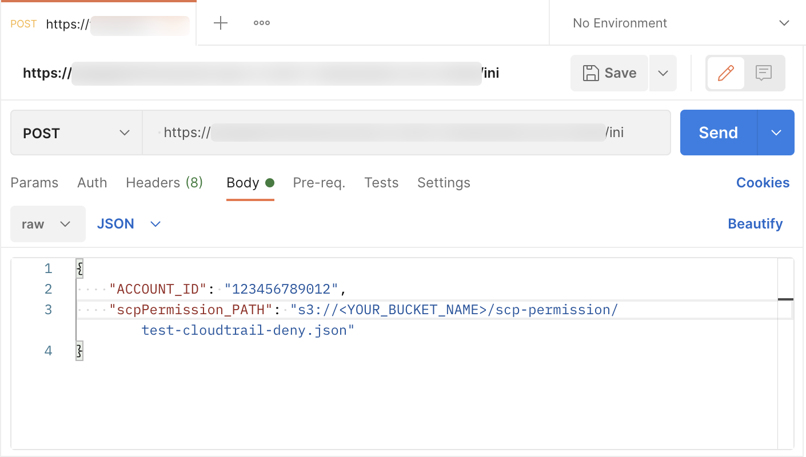

# SCP Workaround in AWS China Regions

[中文](README.md) ｜ English

[Mar 25, 2019](https://aws.amazon.com/about-aws/whats-new/2019/03/service-control-policies-enable-fine-grained-permission-controls/?nc1=h_ls)，AWS released [Service Control Policie (SCP)](https://docs.aws.amazon.com/zh_cn/organizations/latest/userguide/orgs_manage_policies_scps.html) feature. This offers central control over the maximum available permissions for all accounts in your organization. 

Till April 2021, the two AWS regions in mainland China (BJS, ZHY) do not support SCP functionality. An workaround solution of SCP functionality in BJS and ZHY is discussed below. This solution has the following features:

1. Automation. Automatically attaching permission boundary to IAM entities created in the managed account. 
2. Serverless. This solution eliminates the need of EC2, and consequentlly eliminates the maintenance work from OS level.  
3. Low Cost. This solution only generates calls/costs when the user creates an IAM entity, the total cost is close to 0.

**NOTE**: This solution is not retroactive, that is, the permission boundaries of all IAM entities created prior to the deployment of this solution are not controlled by this solution.

You may check the detailed description of architecture design from [here](/architecture/Architecture-ENG.md).

# Deployment and Operation Guide
## Deployment Guide

1. [Resources deployment in Admin Account](deployment/AdminAccount-ENG.md), fullfil the deployment only one time. 

2. [Resources deployment in Pro Account](deployment/ProAccount-ENG.md), fullfil the deployment in each Pro Account once before it is put into use.

## Operation Guide

### Initialize Pro Account

Target: Pro Account.  
Method: Call ```scp/ini``` API.

Login API Gateway console in **Admin Account**, check the invoke ULR from 通过 ```APIs > scp > Stages > poc > /ini > POST```:  


Upload a sample policy to the S3 Bucket created when [deploying the required resources in the Admin Account](deployment/AdminAccount-CHN.md) (Disable the use of CloudTrail services):

```
aws s3 cp deployment/resources/s3-scp-permission/test-cloudtrail-deny.json s3://<YOUR_BUCKET_NAME>/scp-permission/
```

Call API with postman:
>You call the API in any other ways as well.



If you call the API without scpPermission_PATH parameter, [scpBoundaryPolicy.json](deployment/resources/s3-scp-boundary/scpBoundaryPolicy.json) will be attached with each created IAM entity in the Pro Account as a permissions boundary policy.

After calling ```scp/ini```, the Lambda function [scp-01-Initial](deployment/code/scp-01-Initial.py) will be triggered to create the required administrative resources in the Pro Account. 

### Attaching Permisions Boundary

Target: IAM entity in Pro Account.  
Method: Auto-attaching.

After completing the initialization of the Pro Account, both IAM events (CreateUser and CreateRole) could trigger the [scp-03-Permission](deployment/code/scp-03-Permission.py) function, which automatically attaching the permissions boundary policy. 

### Update Permissions Boundary Policy

Target: Permissions boundary policy in Pro Account.  
Method: Call ```scp/update``` API.

Login API Gateway console in **Admin Account**, check the invoke URL from ```APIs > scp > Stages > poc > /update > POST```.

Call the API via postman or any other methods, follow the below format:  

```
{
        "ACCOUNT_ID": "xxxxxxxxxxxx",
        "scpPermission_Path": "s3://xxxxx.json"
}
```

scpPermission_Path is the S3 storage path where the updated permission policy file is located. 

After calling ```scp/update```, the Lambda function [scp-02-Update](deployment/code/scp-02-Update.py) will be triggered to update permissions boundary policy in the Pro Account.  

# Other Notes
Since this solution is independent of the AWS Organizations function, it is not a complete replacement for the SCP feature. In practice, the following points also need to be noted:  

1. This solution does not support [policy inheritance](https://docs.aws.amazon.com/organizations/latest/userguide/orgs_manage_policies_inheritance.html) like SCP, all Pro Accounts' permission boundary policies are independent of each other.
2. All IAM entities in the Pro Account will not be able to set other permissions boundary policies, as this solution uses the [IAM permissions boundary](https://docs.aws.amazon.com/IAM/latest/UserGuide/access_policies_boundaries.html) feature.
3. In this solution, the scpPolicy policy file is formed as a permissions boundary policy by combining [scpBoundaryPolicy.json](resources/s3-scp-boundary/scpBoundaryPolicy.json) with a user-defined scpPermission policy file. This final scpPolicy policy file cannot exceed 6,144 characters, as specified in the [IAM object quotas](https://docs.aws.amazon.com/IAM/latest/UserGuide/reference_iam-quotas.html#reference_iam-quotas-entities).

>The code to check the character count of the combined scpPolicy is already included in the [scp-02-Update](deployment/code/scp-02-Update.py) function.