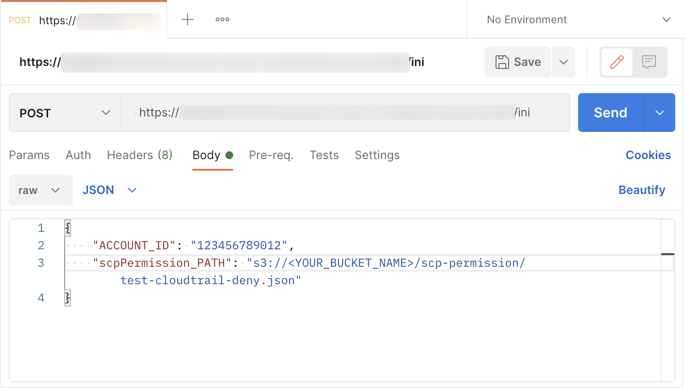

# SCP Workaround in AWS China Regions

中文 ｜ [English](README-ENG.md)

[2019 年 3 月](https://aws.amazon.com/cn/about-aws/whats-new/2019/03/service-control-policies-enable-fine-grained-permission-controls/)，AWS 发布了[服务控制策略](https://docs.aws.amazon.com/zh_cn/organizations/latest/userguide/orgs_manage_policies_scps.html)（Service Control Policies，SCP）功能。这是一种组织策略，可用于管理 AWS Organizations 中的权限。

截止到 2021 年 4 月，AWS 位于中国大陆地区的两个区域（BJS、ZHY）暂未支持 SCP 功能。下面将讨论一种替代方案，以便在 BJS 和 ZHY 实现类似 SCP 的功能。本方案具有如下特点：  

1. 自动化。方案部署完成后，自动对被管理账号中创建的 IAM 实体进行策略关联。  
2. 无服务器化。本方案无需部署 EC2，无需考虑操作系统层的运维工作。  
3. 低成本。无服务器化方案通常机遇调用次数进行计费，本方案仅在用户创建 IAM 实体时产生调用，使用成本接近于 0。

**注意**：本方案不具备追溯功能，即在部署本方案之前创建的所有 IAM 实体的权限边界不受本方案控制。

可以从 [这里](architecture/Architecture-CHN.md) 查看关于架构设计的详细说明。

# 部署及使用说明
## 部署说明
1. [在 Admin Account 中部署所需资源](deployment/AdminAccount-CHN.md)，仅需部署一次。

2. [在 Pro Account 中部署所需资源](deployment/ProAccount-CHN.md)，每个 Pro Account 投入使用前部署一次。

## 使用说明

### 初始化 Pro Account

对象：Pro Account。  
方式：调用 ```scp/ini``` API。

登录 **Admin Account** 的 API Gateway 控制台，通过 ```APIs > scp > 阶段 > poc > /ini > POST```，查看调用 URL：


向 [在 Admin Account 中部署所需资源](deployment/AdminAccount-CHN.md) 时创建的 S3 Bucket 中上传示例策略（禁止使用 CloudTrail 服务）：

```
aws s3 cp deployment/resources/s3-scp-permission/test-cloudtrail-deny.json s3://<YOUR_BUCKET_NAME>/scp-permission/
```

使用 postman 调用 API：  
>也可以使用其它方式调用 API



如果不输入 ```scpPermission_PATH``` 参数，[scpBoundaryPolicy.json](deployment/resources/s3-scp-boundary/scpBoundaryPolicy.json) 将会作为权限边界策略关联给 Pro Account 中每一个创建出来的 IAM 实体。

调用 ```scp/ini``` 后，Lambda 函数 [scp-01-Initial](deployment/code/scp-01-Initial.py) 将被触发，在 Pro Account 中创建所需的管理资源。

### 关联权限边界

对象：Pro Account 被创建的 IAM 实体。  
方式：自动。

完成对 Pro Account 的初始化工作后，CreateUser 和 CreateRole 的事件均会触发  [scp-03-Permission](deployment/code/scp-03-Permission.py) 函数，自动关联权限边界策略。

### 更新权限边界策略

对象：Pro Account 中的权限边界策略。  
方式：调用 ```scp/update``` API。

登录 **Admin Account** 的 API Gateway 控制台，通过 ```APIs > scp > 阶段 > poc > /update > POST```，查看调用 URL。

利用 postman 或其它方式调用 API，保持以下格式：

```
{
        "ACCOUNT_ID": "xxxxxxxxxxxx",
        "scpPermission_Path": "s3://xxxxx.json"
}
```

其中 scpPermission_Path 是更新的权限策略文件所在的 S3 存储路径。 

调用 ```scp/update``` 后，Lambda 函数 [scp-02-Update](deployment/code/scp-02-Update.py) 将被触发，在 Pro Account 中更新权限边界策略。

# 其它注意事项
由于本方案独立于 AWS Organizations 功能，因此它无法完全取代 SCP 功能。在实际使用中，还需要注意以下几点：

1. 本方案不支持类似 SCP 的 [策略继承](https://docs.aws.amazon.com/zh_cn/organizations/latest/userguide/orgs_manage_policies_inheritance.html) 功能，所有 Pro Accounts 的权限边界策略均相互独立。
2. 本方案使用了 IAM 的 [权限边界](https://docs.aws.amazon.com/zh_cn/IAM/latest/UserGuide/access_policies_boundaries.html) 功能， Pro Account 中的所有 IAM 实体将不能再设置其它权限边界策略。
3. 本方案中，通过将 [scpBoundaryPolicy.json](resources/s3-scp-boundary/scpBoundaryPolicy.json) 与用户自定义的 scpPermission 策略文件组合，形成作为权限边界策略的 scpPolicy 策略文件。根据 [IAM 对象配额](https://docs.aws.amazon.com/zh_cn/IAM/latest/UserGuide/reference_iam-quotas.html#reference_iam-quotas-entities) 中的说明，这个最终的 scpPolicy 策略文件不能超过 6,144 个字符。

>在 [scp-02-Update](deployment/code/scp-02-Update.py) 函数中已包含了对组合后的 scpPolicy 进行字符数检查的代码。