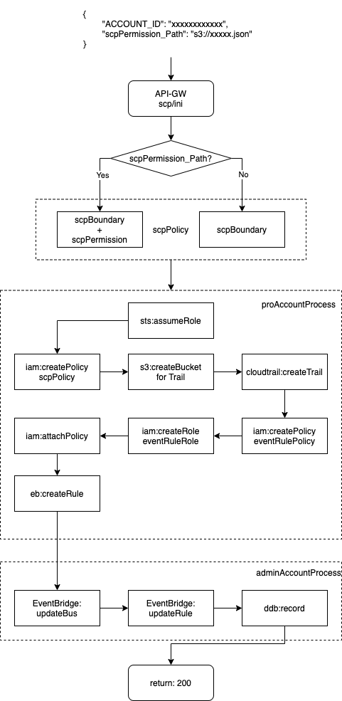

#架构设计

中文 ｜ [English](Architecture-ENG.md)

##总体架构介绍
当用户在 AWS 内创建 IAM 实体（IAM User 或 IAM Role）时，会产生一个事件。本方案就是利用这个事件来触发一个 Lambda 函数，利用这个 Lambda 函数为创建出来的 IAM 实体关联一个权限边界，以此对新创建的 IAM 实体进行权限控制。整个过程如下图所示：  


但从实际应用的角度来看，需要考虑三个关键问题：

1. 当创建出来的 IAM 实体拥有 Admin 权限、或 IAM 权限时，如何确保上述实现机制不被破坏（例如：使用者利用所拥有的 Admin 权限删除 lambda 函数、解除被关联上的权限边界，等等）
2. 需要 SCP 功能的企业往往拥有多个账号，上述方案如何实现对多账号的统一管理？并确保可以针对不同账号设置权限边界？
3. 当被管理账号越来越多时，如何追溯不同账号使用了那种权限边界策略？

为了解决上述三个关键问题，需要增加以下服务：
 
- Amazon API Gateway
- Amazon S3
- Amazon EventBridge
- Amazon DynamoDB
- Amazon SNS

完整架构如下：  


Admin Account 代表管理账号，用于部署、配置相关的管理资源。  
Pro Account 代表生产账号，即需要通过类似 SCP 的功能进行权限限制的被管账号。

##Admin Account 
Admin Account 的作用包括：

1. 对新纳管的账号进行初始化，需要在被纳管账号中创建以下资源：

	- S3 bucket: 用于创建 Cloudtrail trail
	- Cloudtrail trail：用于捕获创建 IAM 实体时产生的实践
	- EventBridge Rule：用于将符合要求的事件传递给 Admin 账号中的事件总线
	- IAM Policy：需要被强制绑定到所有新创建 IAM 实体上的策略

2. 管理 Pro Account 中需要用到的权限边界策略，需要在 **Admin Account** 中创建以下资源：
	- S3 Bucket：保存初始化 Pro Account 所需的配置文件、策略文件
	- DynamoDB Table：记录 Pro Account 使用了哪个权限边界策略文件

3. 接收 Pro Account 中的事件，利用事件触发 Lambda 函数，以便对 Pro Account 中创建出来的 IAM 实体关联权限边界策略。需要在 **Admin Account** 中创建以下资源：
	- EventBridge Bus：用于接收从 Pro Account 发送的 IAM 事件
	- EventBridge Rule：用于过滤出需要的 IAM 事件（(CreateUser 和 CreateRole）

4. 为了实现上述功能的自动化，还需要在 **Admin Account** 中创建以下资源：
	- API Gateway:
		- ini: 初始化 Pro Account
		- update: 更新权限边界策略
	- Lambda:
		- scpIni: 初始化 Pro Account，通过 ```ini``` API 触发
		- scpUpdate: 更新权限边界策略，通过 ```update``` API 处罚
		- scpBoundary: 对 Pro Account 的 IAM 实体自动关联权限边界策略，通过 Pro Account 中的 IAM 事件触发
	- SNS（可选）: 向系统管理员发送通知邮件

##Pro Account
Pro Account 用于承载业务系统，其中 IAM 实体的最大权限受到 Admin Account 的控制。需要在 Pro Account 中部署以下资源（如无特殊说明，以下资源均为必要资源）：

1. IAM Role，需预先在 Pro Account 中创建：
	- adminRole（推荐）：超级管理角色，管理员可以在 Admin Account 中通过 switch role 的方式获得 Pro Account 的全部管理权限
	- scpRole：Admin Account 中的 scpBoundary 函数在执行时需要继承的角色

2. 通过 **Admin Account** 中的 scpIni 函数创建：
	- S3 Bucket: 用于创建 Cloudtrail trail
	- Cloudtrail Trail：用于捕获创建 IAM 实体时产生的事件
	- EventBridge Rule：用于将符合要求的事件传递给 Admin 账号中的事件总线
	- IAM Policy：需要被强制绑定到所有新创建 IAM 实体上的策略

##权限边界策略说明
为实现对 Pro Account 中的 IAM 实体进行权限控制，需要通过 Admin Account 中的 Lambda 函数对 IAM 实体设置权限边界（Permissions Boundary）。

权限边界策略与 IAM 策略的交集决定了 IAM 实体所拥有的实际权限，详细说明可参考 [官方文档](https://docs.aws.amazon.com/zh_cn/IAM/latest/UserGuide/access_policies_boundaries.html)，其关系说明如下图：  


本方案中，权限边界策略需要承担两方面的功能：

1. 限定 Pro Account 中所有 IAM 实体的最大权限边界；
2. 保护本方案在 Pro Account 中创建出来的资源不被破坏。

其中第一点根据不同的 Pro Account 而有所不同，第二点面对所有 Pro Account 都相同。因此，本方案中将权限边界策略分为两个不同的 json 文件：

1. scp-boundary：声明哪些资源受到保护，通常情况下不会改变该文件
2. scp-permission：声明 Pro Account 中 IAM 实体的权限边界，管理员根据实际需要按照标准的 IAM 策略规范编写该文件

<mark>最终关联给 IAM 实体的权限边界策略：**scpPolicy = scpBoundary + scpPermission**</mark>

本方案中提供完整的 scp-boundary 策略文件和一个 scp-permission 策略文件示例。

- [scpBoundaryPolicy.json](resources/s3-scp-boundary/scpBoundaryPolicy.json)：对 Pro Account 中的管理资源进行保护。该策略主要包含以下权限限制：

	- 禁止针对  ```Owner: SCP-Supervisor``` 标签的资源进行任何操作；
	- 禁止针对 ```arn:aws-cn:iam::<ACCOUNT_ID>:policy/scpPolicy``` 策略进行任何修改操作；
	- 允许其它任何操作（由于该策略是作为权限边界关联到 IAM 实体，因此必须显性允许所有操作）

- [test-cloudtrail-deny.json](resources/s3-scp-permission/test-cloudtrail-deny.json)：禁止所有 CloudTrail 操作。

##Lambda 函数说明

###scp-01-Initial
可从 [这里](../deployment/code/scp-01-Initial.py) 查看函数源代码。

通过调用 ```scp/ini``` API 进行触发，在 Pro Account 中创建所需的管理资源。该函数的处理逻辑如下：  


###scp-02-Update
可从 [这里](../deployment/code/scp-02-Update.py) 查看函数源代码。

通过调用 ```scp/update```API进行触发，在 Pro Account 中更新权限边界策略。该函数的处理逻辑如下：  


###scp-03-Permission
可从 [这里](../deployment/code/scp-03-Permission.py) 查看函数源代码。

通过 CreateUser 或 CreateRole 的事件触发，自动关联权限边界策略。该函数的处理逻辑如下：  


[返回 README](../README.md)