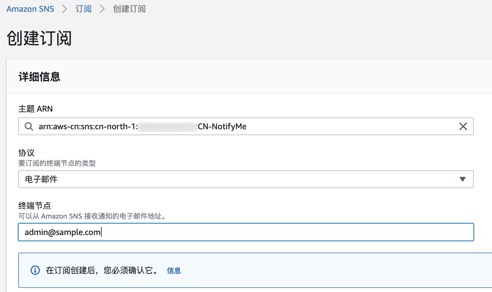
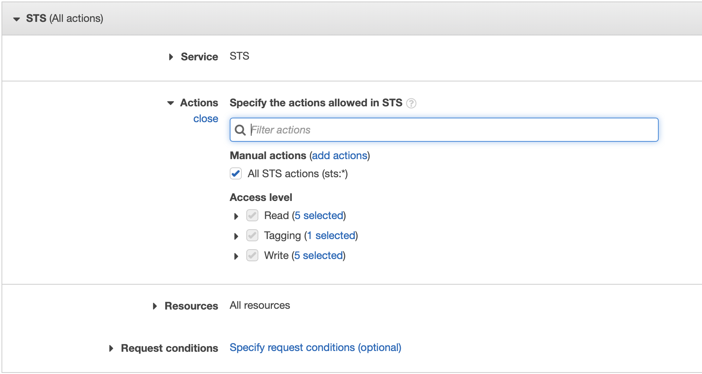
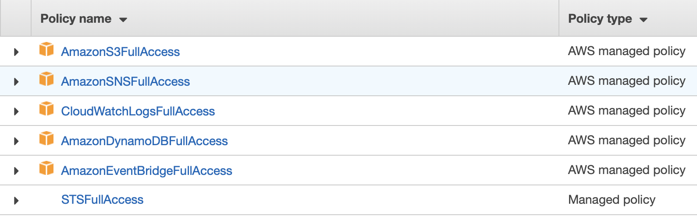
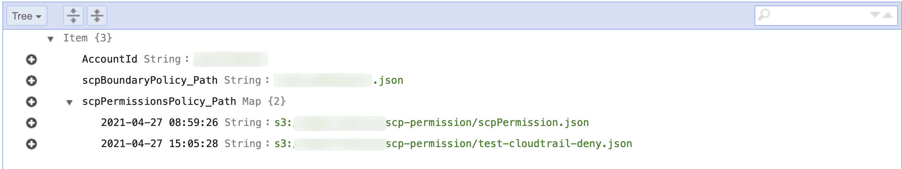
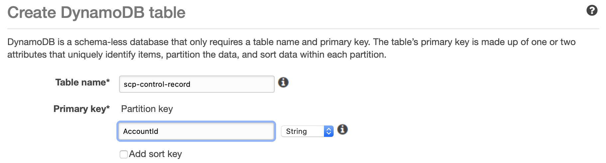
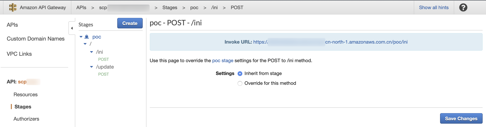

# Deployment in Admin Acount

中文 ｜ [English](AdminAccount-ENG.md)

在 Admin Account 的北京区域（BJS）中依次部署以下资源：
>可以根据自己的管理需要更改资源的名称，但需要注意修改后续操作对应的参数。

序号 | 资源类型 | 资源名称 
----|------|------
1 | EventBridge Bus | scp-bus 
2 | SNS Topic | CN-NotifyMe 
3 | S3 Bucket | \<YOUR\_BUCKET\_NAME>
4 | IAM Role | scpRole 
5 | DynamoDB Table | scp-control-record 
6 | Lambda Function | scp-01-Initial
7 | Lambda Function | scp-02-Update
8 | Lambda Function | scp-03-Permission
9 | EventBridge Rule | scp-rule
10 | API Gateway | scp

**由于需要捕获 IAM 的事件，上述资源 <mark>必须</mark> 部署在北京区域（BJS）**

在 S3 Bucket 创建完成后，还需要将初始化 Pro Admin 所需要的配置文件上传至创建好的 S3 Bucket 内。

# 部署说明
部署说明中的命令参考 [AWS CLI Version 2 命令规范](https://awscli.amazonaws.com/v2/documentation/api/latest/reference/index.html#cli-aws)，需要根据 [官方文档](https://docs.aws.amazon.com/zh_cn/cli/latest/userguide/install-cliv2.html) 提前安装好 AWS CLI version 2 工具，并配置好拥有 Admin Account 中 **管理员权限** 的 AKSK。如您已经安装 AWS CLI Version 1，可对应本方案参考 [AWS CLI Version 1 命令规范](https://docs.aws.amazon.com/cli/latest/reference/)，本方案对可能存在的命令差异不再做进一步说明。

将本方案代码克隆到本地：

```
git clone  https://github.com/weiping-bj/SCP-Workaround-in-AWS-ChinaRegions.git
```

进入方案目录：

```
cd SCP-Workaround-in-AWS-ChinaRegions
```

设置部署时需要用到的常量，```ACCOUNT_ID``` 和 ```BUCKET_NAME```：

```
ACCOUNT_ID=ID=`aws sts get-caller-identity |jq -r ".Account"`

BUCKET_NAME=scp-poc-$ACCOUNT_ID
```

>如未安装 [jq](https://stedolan.github.io/jq/download/) 工具，也可以手工设置 ACCOUNT_ID

## EventBridge Bus
每个 AWS 账号中都包含一个默认的事件总线：default bus，可以使用这个事件总线接受来自其它账号的事件。但建议为本方案创建专门的事件总线：

```
aws events create-event-bus --name scp-bus --region cn-north-1
```

创建成功后，得到 even bus 的 ARN。

执行以下命令，为创建的事件总线添加允许权限：

```
aws events put-permission \
--event-bus-name scp-bus \
--action events:PutEvents \
--principal $ACCOUNT_ID \
--statement-id allow_account_to_put_events \
--region cn-north-1
```

命令正常执行后，无返回结果。登陆 AWS 控制台，在 ```Amazon EventBridge > 事件 > 事件总线 > scp-bus``` 下查看 **权限** 选项，可以看到如下内容：

```
{
  "Version": "2012-10-17",
  "Statement": [{
    "Sid": "allow_account_to_put_events",
    "Effect": "Allow",
    "Principal": {
      "AWS": "arn:aws-cn:iam::<YOUR_ADMIN_ACCOUND_ID>:root"
    },
    "Action": "events:PutEvents",
    "Resource": "arn:aws-cn:events:cn-north-1:<YOUR_ADMIN_ACCOUND_ID>:event-bus/scp-bus-test"
  }]
}
```

## SNS Topic 
当 Pro Account 中创建的 IAM 实体被关联好权限边界策略后，SNS 服务将向系统管理员发送通知邮件。首先需要创建 SNS 主题：

```
aws sns create-topic --name CN-NotifyMe --region cn-north-1
```
创建成功后，返回 SNS Topic 的 ARN。

通过 AWS 控制台选择 ```Amazon SNS > 订阅 > 创建订阅```，输入网络管理员邮件地址，如下图：  


需要通过管理员的邮箱确认上述订阅。

## S3Bucket
创建 S3 Bucket：

```
aws s3api create-bucket --bucket $BUCKET_NAME \
--region cn-north-1 \
--create-bucket-configuration LocationConstraint=cn-north-1
```

创建成功后，返回 S3 Bucket 的 ARN。在 S3 Bucket  中创建 3 个目录。目录名称及作用说明如下：

1. **account-setting/**：初始化 Pro Account 时需要用到的配置文件。

```
aws s3api put-object --bucket $BUCKET_NAME \
--key account-setting/
```
创建完成后，上传所需配置文件，共 4 个：

```
aws s3 sync deployment/resources/s3-account-setting/ s3://$BUCKET_NAME/account-setting/
```

- [eventRuleEventPattern.json](resources/s3-account-setting/eventRuleEventPattern.json)：在 Pro Account 中创建 Event Rule 时，设定 Event Pattern 需要用到的文件。表示接收调用成功的 CreateUser 或 CreateRole 事件。
- [eventRuleRolePolicy.json](resources/s3-account-setting/eventRuleRolePolicy.json)：在 Pro 	Account  中创建 Event Rule 时需要指定一个 Role，这个 Role  的权限是允许 Event Rule 向 Admin Account 中的 ```scp-bus``` 事件总线发送事件。
- [eventRuleRoleTrustRelation.json](resources/s3-account-setting/eventRuleRoleTrustRelation.json)：在 Pro Account  中创建 Event Rule 时需要指定一个 Role，这个 Role 信任的实体是 events.amazonaws.com。
-  [trailS3BucketPolicy.json](resources/s3-account-setting/trailS3BucketPolicy.json)：为了使 EventBridge 可以捕获 CloudTrail API Call 事件，需要创建 CloudTrail trail。在创建 CloudTrail trail 时，需要制定 S3 Bucket。这个 S3 Bucket 需要设定特殊的访问策略。

2. **scp-boundary/**：保护 Pro Account 中控制资源所需要用到的策略文件。

```
aws s3api put-object --bucket $BUCKET_NAME \
--key scp-boundary/
```

创建完成后，上传配置文件，共 1 个：

```
aws s3 cp deployment/resources/s3-scp-boundary/scpBoundaryPolicy.json s3://$BUCKET_NAME/scp-boundary/
```

- [scpBoundaryPolicy.json](resources/s3-scp-boundary/scpBoundaryPolicy.json)：对 Pro Account 中的管理资源进行保护。该策略主要包含以下权限限制：

	- 禁止针对  ```Owner: SCP-Supervisor``` 标签的资源进行任何操作；
	- 禁止针对 ```arn:aws-cn:iam::<ACCOUNT_ID>:policy/scpPolicy``` 策略进行任何修改操作；
	- 允许其它任何操作（由于该策略是作为权限边界关联到 IAM 实体，因此必须显性允许所有操作）

3. **scp-permission/**：限制对 Pro Account 中所有 IAM 实体最大权限边界的策略文件

```
aws s3api put-object --bucket $BUCKET_NAME \
--key scp-permission/
```

此目录中保存需要对 Pro Account 进行权限限制的具体策略文件，用户可根据自己的需要进行上传。

本方案中提供 1 个策略文件：以便进行功能验证，该策略文件禁止所有 CloudTrail 操作：[test-cloudtrail-deny.json](resources/s3-scp-permission/test-cloudtrail-deny.json)

```
aws s3 cp deployment/resources/s3-scp-permission/test-cloudtrail-deny.json s3://$BUCKET_NAME/scp-permission/
```

<mark>最终关联给 IAM 实体的权限边界策略：**scpPolicy = scpBoundary + scpPermission**</mark>


## IAM Role
为本方案中的 3 个 Lambda 函数创建一个统一的 IAM Role。
>您还可以根据需要进一步缩小权限，为每个 Lambda 函数创建独立的 IAM Role。

通过控制台，```IAM > 策略 > 创建策略```：  


此策略的目的是授予对于 STS 的全部访问权限，将该策略命名为 ```STSFullAccess```。

通过控制台，```IAM > 角色 > 创建角色```，选择为 Lambda 创建角色：  


在 ```Attach 权限策略``` 步骤中，选择以下 6 个托管策略：  


其中前 5 个策略为 AWS 托管策略，最后一个是刚刚创建的客户托管策略。将角色命名为 ```scpRole```。

## DynamoDB Table
DynamoDB Table 将记录不同 Pro Account 使用了哪个权限边界策略文件，以及存放在 S3 的路径。示例如下图：  


其中 scpBoundaryPolicy 用于保护 Pro Account 中创建出来的管理资源，scpPermissionsPolicy 用于限制 Pro Account 中 IAM 实体的最大权限。

通过控制台，```DynamoDB > 表 > 创建表```，表的名称为 ```scp-control-record```：  


## Lambda Function
本方案中需要创建 3 个 Lambda 函数对 Pro Account 进行操作：

1. **scp-01-Initial**：初始化环境
2. **scp-02-Update**：更新权限边界策略
3. **scp-03-Permission**：自动向 IAM 实体关联权限边界策略。

### scp-01-Initial

```
aws lambda create-function --function-name scp-01-Initial \
--role "arn:aws-cn:iam::"$ACCOUNT_ID":role/scpRole" \
--runtime python3.6 \
--handler lambda_function.lambda_handler \
--timeout 60 \
--zip-file fileb://deployment/resources/scp-01-Initial.zip \
--environment "Variables={ASSUMED_ROLE=scpRole,\
BOUNDARY_FILE_PATH=s3://$BUCKET_NAME/scp-boundary/scpBoundaryPolicy.json,\
EVENT_PATTERN=s3://$BUCKET_NAME/account-setting/eventRuleEventPattern.json,\
ROLE_POLICY=s3://$BUCKET_NAME/account-setting/eventRuleRolePolicy.json,\
ROLE_TRUST_IDENTITY=s3://$BUCKET_NAME/account-setting/eventRuleRoleTrustRelation.json,\
S3_POLICY=s3://$BUCKET_NAME/account-setting/trailS3BucketPolicy.json,\
TABLE_NAME=scp-control-record,\
TOPIC_ARN=arn:aws-cn:sns:cn-north-1:$ACCOUNT_ID:CN-NotifyMe}" \
--region cn-north-1
```

可以从 [这里](code/scp-01-Initial.py) 查看函数源代码。

函数创建同时，添加了如下环境变量：

Key | Value | 
----|-----
ASSUMED\_ROLE | scpRole 
BOUNDARY\_FILE\_PATH | s3://`<YOUR_BUCKET_NAME>`/scp-boundary/scpBoundaryPolicy.json 
EVENT\_PATTERN | s3://`<YOUR_BUCKET_NAME>`/account-setting/eventRuleEventPattern.json
ROLE\_POLICY | s3://`<YOUR_BUCKET_NAME>`/account-setting/eventRuleRolePolicy.json
ROLE\_TRUST\_IDENTITY | s3://`<YOUR_BUCKET_NAME>`/account-setting/eventRuleRoleTrustRelation.json
S3\_POLICY | s3://`<YOUR_BUCKET_NAME>`/account-setting/trailS3BucketPolicy.json
TABLE\_NAME | scp-control-record
TOPIC\_ARN | arn:aws-cn:sns:cn-north-1:```<ADMIN_ACCOUNT_ID>```:CN-NotifyMe

### scp-02-Update

```
aws lambda create-function --function-name scp-02-Update \
--role "arn:aws-cn:iam::"$ACCOUNT_ID":role/scpRole" \
--runtime python3.6 \
--handler lambda_function.lambda_handler \
--timeout 60 \
--zip-file fileb://deployment/resources/scp-02-Update.zip \
--environment "Variables={ASSUMED_ROLE=scpRole,\
BOUNDARY_FILE_PATH=s3://$BUCKET_NAME/scp-boundary/scpBoundaryPolicy.json,\
TABLE_NAME=scp-control-record,\
TOPIC_ARN=arn:aws-cn:sns:cn-north-1:$ACCOUNT_ID:CN-NotifyMe}" \
--region cn-north-1
```

可以从 [这里](code/scp-02-Update.py) 查看函数源代码。

函数创建同时，添加了如下环境变量：

Key | Value | 
----|-----
ASSUMED\_ROLE | scpRole 
BOUNDARY\_FILE\_PATH | s3://`<YOUR_BUCKET_NAME>`/scp-boundary/scpBoundaryPolicy.json 
TABLE\_NAME | scp-control-record
TOPIC\_ARN | arn:aws-cn:sns:cn-north-1:```<ADMIN_ACCOUNT_ID>```:CN-NotifyMe

### scp-03-Permission

```
aws lambda create-function --function-name scp-03-Permission \
--role "arn:aws-cn:iam::"$ACCOUNT_ID":role/scpRole" \
--runtime python3.6 \
--handler lambda_function.lambda_handler \
--timeout 60 \
--zip-file fileb://deployment/resources/scp-03-Permission.zip \
--environment "Variables={ASSUMED_ROLE=scpRole,\
SCP_BOUNDARY_POLICY=scpPolicy,\
TOPIC_ARN=arn:aws-cn:sns:cn-north-1:$ACCOUNT_ID:CN-NotifyMe}" \
--region cn-north-1
```

可以从 [这里](code/scp-03-Permission.py) 查看函数源代码。

函数创建同时，添加了如下环境变量：

Key | Value | 
----|-----
ASSUMED\_ROLE | scpRole 
SCP\_BOUNDARY\_POLICY | scpPolicy  
TOPIC\_ARN | arn:aws-cn:sns:cn-north-1:```<ADMIN_ACCOUNT_ID>```:CN-NotifyMe

## EventBridge Rule

创建 Event Rule，以允许接收 IAM 的 CreateUser 和 CreateRole 事件：

```
RULE_ARN=`aws events put-rule --name scp-rule \
--event-pattern "{\"source\": [\"aws.iam\"], \"detail-type\": [\"AWS API Call via CloudTrail\"], \"detail\": {\"eventSource\": [\"iam.amazonaws.com\"], \"eventName\": [\"CreateUser\", \"CreateRole\"], \"errorCode\": [{\"exists\": false}]}}" \
--state ENABLED \
--event-bus-name scp-bus \
--region cn-north-1 | jq -r ".RuleArn"`
```

为创建好的 Event Rule 添加目标，以触发 Lambda 函数：scp-03-Permission：

```
aws events put-targets --rule scp-rule \
--event-bus-name scp-bus \
--targets "Id"="1","Arn"="arn:aws-cn:lambda:cn-north-1:"$ACCOUNT_ID":function:scp-03-Permission" \
--region cn-north-1
```

## API Gateway
需要创建两个 API：

- scp/ini：初始化 Pro Account
- scp/update：根据需要调整 scpPermission 策略

创建 APIs：

```
REST_API_ID=`aws apigateway create-rest-api --name scp \
--endpoint-configuration types=REGIONAL \
--region cn-north-1|jq -r ".id"`
```

如未安装 [jq](https://stedolan.github.io/jq/download/) 工具，也可以手工设置 ```REST_API_ID```。执行 ```create-rest-api``` 后，得到如下返回：

```
{
    "id": "xxxxxxx",
    "name": "scp",
    "createdDate": "2021-04-19T22:42:39+08:00",
    "apiKeySource": "HEADER",
    "endpointConfiguration": {
        "types": [
            "REGIONAL"
        ]
    },
    "tags": {},
    "disableExecuteApiEndpoint": false
}
```
设置返回的 id 为 ```REST_API_ID```。

### 创建资源：ini

查看刚创建的 api-gateway 的资源：

```
PARENT_ID=`aws apigateway get-resources --rest-api-id $REST_API_ID --region cn-north-1 | jq -r ".items" | jq -r ".[0].id"`
```

如仅执行 ```get-resources```，得到如下返回：

```
{
    "items": [
        {
            "id": "yyyyyyyyyy",
            "path": "/"
        }
    ]
}
```

可手工记录下返回的 id 并设置为 ```PARENT_ID```。

创建资源：

```
RESOURCE_ID_INI=`aws apigateway create-resource --rest-api-id $REST_API_ID \
--parent-id $PARENT_ID \
--path-part ini \
--region cn-north-1 |jq -r ".id"`
```

如仅执行 ```create-resource```，记录下返回的资源 id，并手工设置 ```RESOURCE_ID_INI```：

```
{
    "id": "zzzzzz",
    "parentId": "yyyyyyyyyy",
    "pathPart": "ini",
    "path": "/ini"
}
```

为资源创建方法：

```
aws apigateway put-method --rest-api-id $REST_API_ID \
--resource-id $RESOURCE_ID_INI \
--http-method POST \
--authorization-type NONE \
--region cn-north-1
```

为创建的方法设定集成：

```
aws apigateway put-integration --rest-api-id $REST_API_ID \
--resource-id $RESOURCE_ID_INI \
--http-method POST \
--type AWS --integration-http-method POST \
--uri 'arn:aws-cn:apigateway:cn-north-1:lambda:path/2015-03-31/functions/arn:aws-cn:lambda:cn-north-1:'$ACCOUNT_ID':function:scp-01-Initial/invocations' \
--region cn-north-1
```

为 Lambda 函数 ```scp-01-Initial``` 添加允许 API Gateway 调用的权限：

```
aws lambda add-permission --function-name scp-01-Initial \
--statement-id AllowInvokeFromSCP_ini \
--action lambda:InvokeFunction \
--principal apigateway.amazonaws.com \
--source-arn "arn:aws-cn:execute-api:cn-north-1:"$ACCOUNT_ID":"$REST_API_ID"/*/POST/ini" \
--region cn-north-1
```


### 创建资源：update

创建资源：

```
RESOURCE_ID_UPDATE=`aws apigateway create-resource --rest-api-id $REST_API_ID \
--parent-id $PARENT_ID \
--path-part update \
--region cn-north-1 |jq -r ".id"`
```

如仅执行 ```create-resource```，记录下返回的资源 id，并手工设置 ```RESOURCE_ID_UPDATE```：

```
{
    "id": "aaaaaa",
    "parentId": "yyyyyyyyyy",
    "pathPart": "update",
    "path": "/update"
}
```

为资源创建方法：

```
aws apigateway put-method --rest-api-id $REST_API_ID \
--resource-id $RESOURCE_ID_UPDATE \
--http-method POST \
--authorization-type NONE \
--region cn-north-1
```

为创建的方法设定集成：

```
aws apigateway put-integration --rest-api-id $REST_API_ID \
--resource-id $RESOURCE_ID_UPDATE \
--http-method POST \
--type AWS --integration-http-method POST \
--uri 'arn:aws-cn:apigateway:cn-north-1:lambda:path/2015-03-31/functions/arn:aws-cn:lambda:cn-north-1:'$ACCOUNT_ID':function:scp-02-Update/invocations' \
--region cn-north-1
```

为 Lambda 函数 ```scp-02-Update``` 添加允许 API Gateway 调用的权限：

```
aws lambda add-permission --function-name scp-02-Update \
--statement-id AllowInvokeFromSCP_update \
--action lambda:InvokeFunction \
--principal apigateway.amazonaws.com \
--source-arn "arn:aws-cn:execute-api:cn-north-1:"$ACCOUNT_ID":"$REST_API_ID"/*/POST/update" \
--region cn-north-1
```

### 部署 API

```
aws apigateway create-deployment --rest-api-id $REST_API_ID \
--stage-name poc \
--region cn-north-1
```

通过 API Gateway 控制台，```API > scp > 阶段 > poc > /ini > POST``` 和 ```API > scp > 阶段 > poc > /update > POST``` 可以查看到两个 API 的调用 URL，如下图：  


API 的使用参考 README 文档中的使用说明部分。

[返回 README](../README.md#使用说明)
