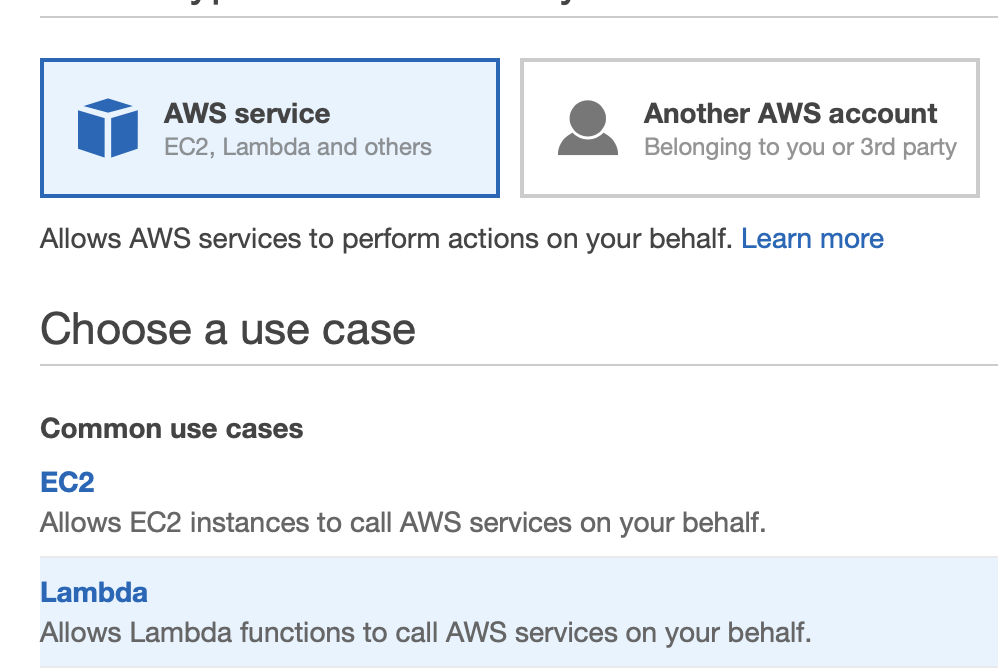

# Deployment in Admin Acount

中文 ｜ [English](README-ENG.md)

在 Admin Account 的北京区域（BJS）中依次部署以下资源：
>可以根据自己的管理需要更改资源的名称，但需要注意修改后续操作对应的参数。

序号 | 资源类型 | 资源名称 
----|------|------
1 | EventBridge Bus | scp-bus 
2 | SNS Topic | CN-NotifyMe 
3 | S3 Bucket | [YourBucketName] 
4 | IAM Role | scpRole 
5 | DynamoDB Table | scp-control-record 
6 | Lambda Function | scp-01-Initial
7 | Lambda Function | scp-02-Update
8 | Lambda Function | scp-03-Permission
9 | EventBridge Rule | scp-rule

**由于需要捕获 IAM 的事件，上述资源 <mark>必须</mark> 部署在北京区域（BJS）**

资源部署完成后，将初始化 Pro Admin 所需要的配置文件上传至创建好的 S3 Bucket 内。

# 部署说明
部署说明中的命令参考 [AWS CLI Version 2 命令规范](https://awscli.amazonaws.com/v2/documentation/api/latest/reference/index.html#cli-aws)，需要根据 [官方文档](https://docs.aws.amazon.com/cli/latest/userguide/install-cliv2.html) 提前安装好 AWS CLI version 2 工具，并配置好拥有 Admin Account 中 **管理员权限** 的 AKSK。如您已经安装 AWS CLI Version 1，可对应本方案参考 [AWS CLI Version 1 命令规范](https://docs.aws.amazon.com/cli/latest/reference/)，本方案对可能存在的命令差异不再做进一步说明。

所创建的所有资源，对应的名称如下表：


## EventBridge Bus
每个 AWS 账号中都包含一个默认的事件总线：default bus，可以使用这个事件总线接受来自其它账号的事件。但建议为本方案创建专门的事件总线：

```
aws events create-event-bus --name scp-bus --region cn-north-1
```

创建成功后，得到 even bus 的 ARN。

执行以下命令，为创建的事件总线添加允许权限：

```
aws events put-permission \
--event-bus-name scp-bus \
--action events:PutEvents \
--principal <YOUR_ADMIN_ACCOUND_ID> \
--statement-id allow_account_to_put_events \
--region cn-north-1
```

命令正常执行后，无返回结果。登陆 AWS 控制台，在 Amazon EventBridge > 事件 > 事件总线 > scp-bus-test 下查看 **权限** 选项，可以看到如下内容：

```
{
  "Version": "2012-10-17",
  "Statement": [{
    "Sid": "allow_account_to_put_events",
    "Effect": "Allow",
    "Principal": {
      "AWS": "arn:aws-cn:iam::<YOUR_ADMIN_ACCOUND_ID>:root"
    },
    "Action": "events:PutEvents",
    "Resource": "arn:aws-cn:events:cn-north-1:<YOUR_ADMIN_ACCOUND_ID>:event-bus/scp-bus-test"
  }]
}
```

## SNS Topic 
当 Pro Account 中创建的 IAM 实体被关联好权限边界策略后，SNS 服务将向系统管理员发送通知邮件。首先需要创建 SNS 主题：

```
aws sns create-topic --name CN-NotifyMe --region cn-north-1
```
创建成功后，返回 SNS Topic 的 ARN。

通过 AWS 控制台选择 Amazon SNS > 订阅 > 创建订阅，输入网络管理员邮件地址，如下图：  


## S3 Bucket
创建 S3 Bucket：

```
aws s3api create-bucket --bucket <YOUR_BUCKET_NAME> \
--region cn-north-1 \
--create-bucket-configuration LocationConstraint=cn-north-1
```

创建成功后，返回 S3 Bucket 的 ARN。在 S3 Bucket  中创建 3 个目录。目录名称及作用说明如下：

- account-setting/：初始化 Pro Account 时需要用到的配置文件
- scp-boundary/：保护 Pro Account 中控制资源所需要用到的策略文件
- scp-permission/：限制对 Pro Account 中所有 IAM 实体最大权限边界的策略文件


## IAM Role
为本方案中的 3 个 Lambda 函数创建一个统一的 IAM Role。
>您还可以根据需要进一步缩小权限，为每个 Lambda 函数创建独立的 IAM Role。

通过控制台，IAM > 策略 > 创建策略：  


此策略的目的是授予对象 STS 的全部访问权限，将该策略命名为 ```STSFullAccess```。

通过控制台，IAM > 角色 > 创建角色，选择为 Lambda 创建角色：  


在【Attach 权限策略】时，选择以下 6 个托管策略：  


其中前 5 个策略为 AWS 托管策略，最后一个是刚刚创建的客户托管策略。

## DynamoDB Table
DynamoDB Table 将记录不同 Pro Account 使用了哪个权限边界策略文件，以及存放在 S3 的路径。示例如下图：


其中 scpBoundaryPolicy 用于保护 Pro Account 中创建出来的管理资源，scpPermissionsPolicy 用于限制 Pro Account 中 IAM 实体的最大权限。

通过控制台，DynamoDB > 表 > 创建表，表的名称为 ```scp-control-record```：


## Lambda Function
本方案中需要创建 3 个 Lambda 函数对 Pro Account 进行操作，功能分别为：初始化环境，更新权限边界策略，自动向 IAM 实体关联权限边界策略。

### scp-01-Initial

```
aws lambda create-function --function-name scp-01-Initial \
--role arn:aws-cn:iam::<ADMIN_ACCOUNT_ID>:role/scpRole \
--runtime python3.6 \
--handler lambda_function.lambda_handler \
--timeout 60 \
--zip-file fileb://deployment/resources/scp-01-Initial.zip \
--region cn-north-1
```

可以从 [这里](code/scp-01-Initial.py) 查看函数源代码。