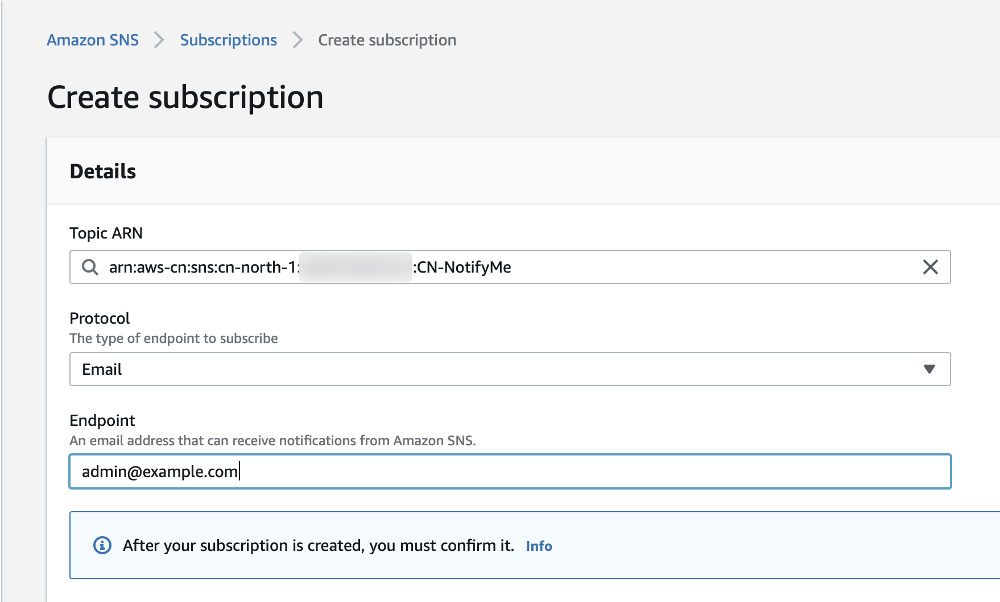

# Deployment in Admin Acount

[中文](AdminAccount-CHN.md) ｜ English

Deploy the following resources in Beijing Region (BJS) in the Admin Account:  
>You may change the resource name based on your management requirements, but you need to pay attention to modify the parameters corresponding to the subsequent operation.

Item | Resource Type | Resource Name 
----|------|------
1 | EventBridge Bus | scp-bus 
2 | SNS Topic | CN-NotifyMe 
3 | S3 Bucket | \<YOUR\_BUCKET\_NAME>
4 | IAM Role | scpRole 
5 | DynamoDB Table | scp-control-record 
6 | Lambda Function | scp-01-Initial
7 | Lambda Function | scp-02-Update
8 | Lambda Function | scp-03-Permission
9 | EventBridge Rule | scp-rule
10 | API Gateway | scp

**Due to the need to capture IAM events, the above resource <mark>must</mark> be deployed in Beijing region (BJS)**

After the creation of S3 Bucket, you also need to upload the configuration files into the created S3 Bucket.

# Deployment Guide
The commands in this deployment guide refer to the [AWS CLI Version 2 command specification](https://awscli.amazonaws.com/v2/documentation/api/latest/reference/index.html#cli-aws), and you need to install the AWS CLI version 2 tool in advance according to the [official documentation](https://docs.aws.amazon.com/cli/latest/userguide/install-cliv2.html) and configure the AKSK with administrator privileges in the Admin Account. If you have already installed AWS CLI Version 1, you can refer to [AWS CLI Version 1 command specification](https://docs.aws.amazon.com/cli/latest/reference/), this guide will not explain the possible command differences between these two CLI versions.

## EventBridge Bus
Each AWS account contains a default event bus: default bus, which can be used to accept events from other accounts. However, it is recommended to create a dedicated event bus for this solution:  

```
aws events create-event-bus --name scp-bus --region cn-north-1
```

After successful creation, the ARN of event bus is displayed as a response.

Execute the following command to add allowed permissions to the created event bus:  

```
aws events put-permission \
--event-bus-name scp-bus \
--action events:PutEvents \
--principal <YOUR_ADMIN_ACCOUND_ID> \
--statement-id allow_account_to_put_events \
--region cn-north-1
```

After the successful excecution of above command, no results are returned. Log in to the AWS console and check ```Amazon EventBridge > Events > Event Buses > scp-bus``` for the **Permissions** option as the following: 

```
{
  "Version": "2012-10-17",
  "Statement": [{
    "Sid": "allow_account_to_put_events",
    "Effect": "Allow",
    "Principal": {
      "AWS": "arn:aws-cn:iam::<YOUR_ADMIN_ACCOUND_ID>:root"
    },
    "Action": "events:PutEvents",
    "Resource": "arn:aws-cn:events:cn-north-1:<YOUR_ADMIN_ACCOUND_ID>:event-bus/scp-bus-test"
  }]
}
```

## SNS Topic 
When the IAM entity created in Pro Account is attached with a permission boundary policy, the SNS service will send a notification email to the system administrator. Create this SNS topic:  

```
aws sns create-topic --name CN-NotifyMe --region cn-north-1
```

After successful creation, the ARN of SNS Topic is displayed as a response.

Through the AWS console, select ```Amazon SNS > Subscriptions > Create Subscription``` and enter the network administrator email address, as follows:   


You need to confirm this subscription via admin email.

## S3Bucket
Create S3 Bucket:  

```
aws s3api create-bucket --bucket <YOUR_BUCKET_NAME> \
--region cn-north-1 \
--create-bucket-configuration LocationConstraint=cn-north-1
```

After successful creation, the ARN of S3 Bucket is displayed as a response. Create three folders in this S3 Bucket, detailed descriptions are as follows:  

1. **account-setting/**: The configuration files required to initialize the Pro Account.

```
aws s3api put-object --bucket <YOUR_BUCKET_NAME> \
--key account-setting/
```

Once created, upload the required configuration files, four files in total:

```
aws s3 sync deployment/resources/s3-account-setting/ s3://<YOUR_BUCKET_NAME>/account-setting/
```

- [eventRuleEventPattern.json](resources/s3-account-setting/eventRuleEventPattern.json): When creating an Event Rule in Pro Account, the policy file required for setting the Event Pattern. Indicates that receiving the successful call from CreateUser or CreateRole events.
- [eventRuleRolePolicy.json](resources/s3-account-setting/eventRuleRolePolicy.json): When creating an Event Rule in a Pro Account, you need to assign a Role with the permission to allow the Event Rule to send events to the ```scp-bus``` event bus in the Admin Account. 
- [eventRuleRoleTrustRelation.json](resources/s3-account-setting/eventRuleRoleTrustRelation.json): When creating an Event Rule in a Pro Account, you need to assign a Role that trusts the entity:  events.amazonaws.com.  
-  [trailS3BucketPolicy.json](resources/s3-account-setting/trailS3BucketPolicy.json): In order for EventBridge to capture CloudTrail API Call events, a CloudTrail trail needs to be created, and when creating the CloudTrail trail, an S3 Bucket needs to be created. This S3 Bucket requires a specific access policies.

2. **scp-boundary/**: The statement from this policy file will protect all administrative resources in Pro Account from being destroyed. 

```
aws s3api put-object --bucket <YOUR_BUCKET_NAME> \
--key scp-boundary/
```

Once created, upload the configuration files, just one file in total:  

```
aws s3 cp deployment/resources/s3-scp-boundary/scpBoundaryPolicy.json s3://<YOUR_BUCKET_NAME>/scp-boundary/
```

- [scpBoundaryPolicy.json](resources/s3-scp-boundary/scpBoundaryPolicy.json): Protects the administrative resources in the Pro Account. The policy contains mainly three following permission:

	- Prohibit any operations against resources tagged with ```Owner: SCP-Supervisor```;
	- Prohibit any modifications to the ```arn:aws-cn:iam::<ACCOUNT_ID>:policy/scpPolicy``` policy;
	- Allow any other operations (since the policy is associated to the IAM entity as a permissions boundary, all other operations must be explicitly allowed)

3. **scp-permission/**: Policy file that limits the maximum permission boundary for all IAM entities in the Pro Account

```
aws s3api put-object --bucket <YOUR_BUCKET_NAME> \
--key scp-permission/
```

This folder holds the specific policy files that need to be restricted for Pro Account permissions, which users may upload based on their own requirements.

One policy file is provided in this repository for functional validation, this policy file disables all CloudTrail operations: [test-cloudtrail-deny.json](resources/s3-scp-permission/test-cloudtrail-deny.json)

```
aws s3 cp deployment/resources/s3-scp-permission/test-cloudtrail-deny.json s3://<YOUR_BUCKET_NAME>/scp-permission/
```

<mark>The permissions boundary policy that is finally attached to the IAM entity: **scpPolicy = scpBoundary + scpPermission**</mark>


## IAM Role
Create a unified IAM Role for the three Lambda functions in this solution.
>You can further limit the permissions as needed by creating a separate IAM Role for each Lambda function.

Login AWS console，```IAM > Policies > Create Policy```：  


The purpose of this policy is to grant full access to AWS STS, which is named ```STSFullAccess```.

Login AWS console, ```IAM > Roles > Create Role```, create a role for AWS Lambda:   


In the step of ```Attach permissions policies```, choose the following six managed policies:   


The first five policies are AWS managed policies, and the last one is a customer managed policy that was just created.

## DynamoDB Table
The DynamoDB Table will record which permission boundary policy file is used by different Pro Accounts and the S3 path of the policy file. An example is shown below:  


The scpBoundaryPolicy is used to protect the administrative resources created in the Pro Account, and the scpPermissionsPolicy is used to limit the maximum permissions of the IAM entities in the Pro Account.

Login AWS console, ```DynamoDB > Tables > Create Table```, the table name is ```scp-control-record```:    


## Lambda Function
In this soluton, three Lambda functions need to be created to operate on the Pro Account resources: 

1. **scp-01-Initial**: initialize the environment
2. **scp-02-Update**: update the permission boundary policy
3. **scp-03-Permission**: automatically associate the permission boundary policy to the IAM entity

### scp-01-Initial

```
aws lambda create-function --function-name scp-01-Initial \
--role arn:aws-cn:iam::<ADMIN_ACCOUNT_ID>:role/scpRole \
--runtime python3.6 \
--handler lambda_function.lambda_handler \
--timeout 60 \
--zip-file fileb://deployment/resources/scp-01-Initial.zip \
--region cn-north-1
```

You may review the source code from [here](code/scp-01-Initial.py).

After the create of this lambda function, set environment variables according to the following table:

Key | Value | 
----|-----
ASSUMED\_ROLE | scpRole 
BOUNDARY\_FILE\_PATH | s3://`<YOUR_BUCKET_NAME>`/scp-boundary/scpBoundaryPolicy.json 
EVENT\_PATTERN | s3://`<YOUR_BUCKET_NAME>`/account-setting/eventRuleEventPattern.json
ROLE\_POLICY | s3://`<YOUR_BUCKET_NAME>`/account-setting/eventRuleRolePolicy.json
ROLE\_TRUST\_IDENTITY | s3://`<YOUR_BUCKET_NAME>`/account-setting/eventRuleRoleTrustRelation.json
S3\_POLICY | s3://`<YOUR_BUCKET_NAME>`/account-setting/trailS3BucketPolicy.json
TABLE\_NAME | scp-control-record
TOPIC\_ARN | arn:aws-cn:sns:cn-north-1:```<ADMIN_ACCOUNT_ID>```:CN-NotifyMe

### scp-02-Update
```
aws lambda create-function --function-name scp-02-Update \
--role arn:aws-cn:iam::<ADMIN_ACCOUNT_ID>:role/scpRole \
--runtime python3.6 \
--handler lambda_function.lambda_handler \
--timeout 60 \
--zip-file fileb://deployment/resources/scp-02-Update.zip \
--region cn-north-1
```
You may review the source code from [here](code/scp-02-Update.py).

After the create of this lambda function, set environment variables according to the following table:

Key | Value | 
----|-----
ASSUMED\_ROLE | scpRole 
BOUNDARY\_FILE\_PATH | s3://`<YOUR_BUCKET_NAME>`/scp-boundary/scpBoundaryPolicy.json 
TABLE\_NAME | scp-control-record
TOPIC\_ARN | arn:aws-cn:sns:cn-north-1:```<ADMIN_ACCOUNT_ID>```:CN-NotifyMe

### scp-03-Permission

```
aws lambda create-function --function-name scp-03-Permission \
--role arn:aws-cn:iam::<ADMIN_ACCOUNT_ID>:role/scpRole \
--runtime python3.6 \
--handler lambda_function.lambda_handler \
--timeout 60 \
--zip-file fileb://deployment/resources/scp-03-Permission.zip \
--region cn-north-1
```

You may review the source code from [here](code/scp-03-Permission.py).

After the create of this lambda function, set environment variables according to the following table:

Key | Value | 
----|-----
ASSUMED\_ROLE | scpRole 
SCP\_BOUNDARY\_POLICY | scpPolicy  
TOPIC\_ARN | arn:aws-cn:sns:cn-north-1:```<ADMIN_ACCOUNT_ID>```:CN-NotifyMe

## EventBridge Rule
Create an Event Rule to allow the reception of IAM events: CreateUser and CreateRole:

```
aws events put-rule --name scp-rule \
--event-pattern "{\"source\": [\"aws.iam\"], \"detail-type\": [\"AWS API Call via CloudTrail\"], \"detail\": {\"eventSource\": [\"iam.amazonaws.com\"], \"eventName\": [\"CreateUser\", \"CreateRole\"], \"errorCode\": [{\"exists\": false}]}}" \
--state ENABLED \
--event-bus-name scp-bus \
--region cn-north-1
```

Add a target to the created Event Rule to trigger the Lambda function: scp-03-Permission.

```
aws events put-targets --rule scp-rule \
--event-bus-name scp-bus \
--targets "Id"="1","Arn"="arn:aws-cn:lambda:cn-north-1:<ADMIN_ACCOUNT_ID>:function:scp-03-Permission" \
--region cn-north-1
```

## API Gateway
Two APIs need to be created in this solution:

- scp/ini：Initialize Pro Account
- scp/update：Modify scpPermission policy

Create APIs：

```
aws apigateway create-rest-api --name scp \
--endpoint-configuration types=REGIONAL \
--region cn-north-1
```

The succesful creation will return the following result:

```
{
    "id": "xxxxxxx",
    "name": "scp",
    "createdDate": "2021-04-19T22:42:39+08:00",
    "apiKeySource": "HEADER",
    "endpointConfiguration": {
        "types": [
            "REGIONAL"
        ]
    },
    "tags": {},
    "disableExecuteApiEndpoint": false
}
```
Record the returned id (as rest-api-id).

### Create Resource: ini

Check the resources of the api-gateway just created:

```
aws apigateway get-resources --rest-api-id xxxxxx --region cn-north-1
```

Response as belows:

```
{
    "items": [
        {
            "id": "yyyyyyyyyy",
            "path": "/"
        }
    ]
}
```

Record the returned id (as parents-id).

Create resource:

```
aws apigateway create-resource --rest-api-id xxxxxxx \
--parent-id yyyyyyyyyy \
--path-part ini \
--region cn-north-1
```

The successful creation will returen the following result, record returned id (as resource-id):

```
{
    "id": "zzzzzz",
    "parentId": "yyyyyyyyyy",
    "pathPart": "ini",
    "path": "/ini"
}
```

Create method for the resource:

```
aws apigateway put-method --rest-api-id xxxxxxx \
--resource-id zzzzzz \
--http-method POST \
--authorization-type NONE \
--region cn-north-1
```

Create integration for the methode:

```
aws apigateway put-integration --rest-api-id xxxxxxx \
--resource-id zzzzzz \
--http-method POST \
--type AWS --integration-http-method POST \
--uri 'arn:aws-cn:apigateway:cn-north-1:lambda:path/2015-03-31/functions/arn:aws-cn:lambda:cn-north-1:<ADMIN_ACCOUNT_ID>:function:scp-01-Initial/invocations' \
--region cn-north-1
```

### Create Resource: update

Create Resource:

```
aws apigateway create-resource --rest-api-id xxxxxxx \
--parent-id yyyyyyyyyy \
--path-part update \
--region cn-north-1
```

The successful creation will returen the following result, record returned id (as resource-id):

```
{
    "id": "aaaaaa",
    "parentId": "yyyyyyyyyy",
    "pathPart": "ini",
    "path": "/ini"
}
```

Create method for the resource:

```
aws apigateway put-method --rest-api-id xxxxxxx \
--resource-id aaaaaa \
--http-method POST \
--authorization-type NONE \
--region cn-north-1
```

Create integration for the methode:

```
aws apigateway put-integration --rest-api-id xxxxxxx \
--resource-id aaaaaa \
--http-method POST \
--type AWS --integration-http-method POST \
--uri 'arn:aws-cn:apigateway:cn-north-1:lambda:path/2015-03-31/functions/arn:aws-cn:lambda:cn-north-1:<ADMIN_ACCOUNT_ID>:function:scp-02-Unitial/invocations' \
--region cn-north-1
```

### Deploy API

```
aws apigateway create-deployment --rest-api-id xxxxxxx \
--stage-name poc \
--region cn-north-1
```

Login AWS console of API Gateway, ```API > scp > Stages > poc > /ini > POST``` and ```API > scp > Stages > poc > /update > POST``` check the invoke URLs of ```ini``` and ```update``` separately, as follows:    


For the use of the API, refer to the usage notes section in the README-ENG documentation.

[Return README-ENG](../README-ENG.md)
