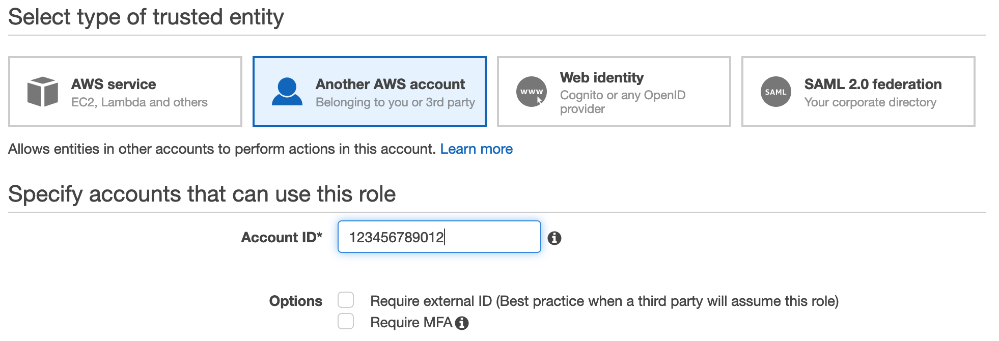
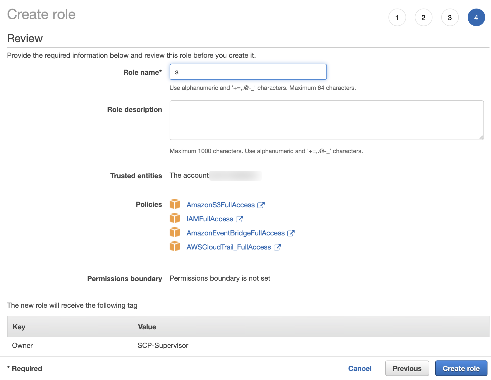

# Deployment-in-Pro-Acount

中文 ｜ [English](ProAccount-ENG.md)

## 资源创建
用户只需在 Pro Account 手工创建 1 个资源：IAM Role。

Pro Account 中所需要的其它管理资源会通过 Lambda 函数 [scp-01-Initial](code/scp-01-Initial.py) 进行创建，该函数部署在 Admin Account 中，通过 scp/ini API 触发。在函数执行过程中，需要通过 Assume Role 的方式获取在 Pro Account 中的必要权限。这个被 Assume 的 Role 就是需要用户手工创建的 IAM Role。其创建过程如下：

1. **选择信任实体：Admin Account**  
登陆 AWS 控制台，选择 ```IAM > 角色 > 创建角色```，选择 “其他 AWS 账户” 作为信任实体，输入 Admin Account 的 12 位 AccountId。  


2. **选择关联的策略：**
	- AmazonS3FullAccess 
	- IAMFullAccess 
	- AmazonEventBridgeFullAccess 
	- AWSCloudTrail_FullAccess 

3. **为角色添加标签：**  

	Key | Value 
	----|-----
	Owner | SCP-Supervisor

4. **为角色命名：scpRole**  
输入角色名称：```scpRole```  


## 补充说明
由于本方案不具备追溯性，因此在生产账号投入使用前，除了创建账号时产生的 IAM 实体外，建议只保留 1 个具有 ```AdministratorAccess``` 权限的 IAM 实体（User 或 Role）。这个额外的 IAM 实体作为日常运维使用。

- 如果 Pro Account 账号通过 AWS Organizations 创建，在账号内会自动创建一个 IAM Role，信任实体为 AWS Organizations 的主账号，权限为 ```AdministratorAccess``` 。
- 如果 Pro Account 账号通过标准流程创建，在账号内会有一个 IAM User，权限为 ```AdministratorAccess``` 。

>在 AWS 中国大陆地区的两个区域，用户不会获得根账号的登录权限。

管理员可以利用上述的初始 IAM 实体在 Pro Account 创建 scpRole，之后通过调用 scp/ini 完成在 Pro Account 中其它资源的创建工作。

[返回 README](../README.md)
